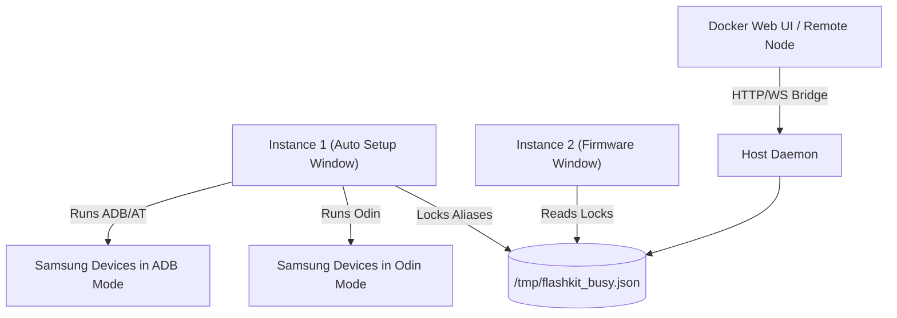

# FlashKit ⚡

Modern, High-Performance, Multi-Instance Android Device Flashing & Provisioning Suite built with Rust (Tauri), TypeScript, and React. Engineered for high-throughput device labs, repair hubs, and automation pipelines with an **Industrial Dark Aesthetic**.


---

## Key Features 🚀

### 1. Multi-Instance Safe Architecture
- **Independent Workers**: Open multiple windows/instances simultaneously. Each instance acts as an autonomous worker with its own local execution state, selected devices, firmware slots, and logs.
- **Hardware-Level Device Locking**: Centralized busy device state engine (`busy.json`) locks units across instances using all aliases (Serial, Raw USB Port `1-3.4.1.4`, `USB:1-3.4.1.4`, and Odin devnodes).
- **Zero Race Condition**: Clean, unified single-state card rendering eliminates badge flickering, double status clashes, and cross-instance UI mirroring.

### 2. Automated Master Sequence
- **Odin Firmware Flashing**: Multi-slot flashing (BL, AP, CP, CSC, USERDATA) with automated device model detection and AP file highlighting.
- **Device Boot Detection**: Intelligent polling for device reboot completion post-flash.
- **Setup Wizard Bypass**: Automated SUW skip without manual screen interaction.
- **AT Exploit Integration**: Wakes up USB Debugging on locked devices via modem AT commands.
- **Automated GBA / Custom Provisioning**: Configurable sequence execution.
- **Batch WiFi Provisioning**: Broadcasts and connects multiple devices to target SSIDs simultaneously.

### 3. Dual Runtime: Desktop & Web Bridge
- **Native Desktop App**: Built on Tauri v2 with native high-speed USB/ADB polling and raw terminal backend.
- **Docker Web UI & Bridge**: Run in distributed environments with a web dashboard connecting to remote workstation daemons.

---

## Architecture Overview 📐



---

## Quick Start 🛠️

### Prerequisites
- **Linux (Debian / Ubuntu / Pop!_OS / Fedora)**:
  - Udev rules configured for Samsung devices (`idVendor=04e8`) to enable rootless ADB and Odin access.
  - `odin4` binary placed in system path (`/usr/local/bin/odin4` atau `/usr/bin/odin4`).
  - Python 3 with `pyudev` and `pyserial` for daemon operations.
- **Windows**:
  - Official Samsung USB Drivers installed.

### Installation
1. Download the latest `.deb` or `.rpm` package from the repository releases or build artifacts.
2. Install the package:
   ```bash
   sudo dpkg -i deb/FlashKit_1.8.61_amd64.deb
   # or
   sudo apt install -f ./deb/FlashKit_1.8.61_amd64.deb
   ```
3. Launch FlashKit:
   ```bash
   flashkit
   ```

---

## Development & Build 💻

### 1. Install Toolchain Dependencies
- [Node.js](https://nodejs.org/) (v20+ recommended)
- [Rust & Cargo](https://rustup.rs/) (v1.75+ recommended)
- Tauri dependencies (`libwebkit2gtk-4.1-dev`, `libappindicator3-dev`, `librsvg2-dev`, `patchelf`)

### 2. Setup Repository
```bash
git clone https://github.com/endrisusanto/FlashKit.git
cd FlashKit/bow-rust
npm install
```

### 3. Local Development
```bash
# Run Tauri desktop app in dev mode with hot-reload
npm run tauri dev
```

### 4. Production Build
```bash
# Build DEB packages and Docker Web container in one command:
./build_packages.sh
```

---

## License 📄
Private & Proprietary. All rights reserved by **Endri-Pro**.
