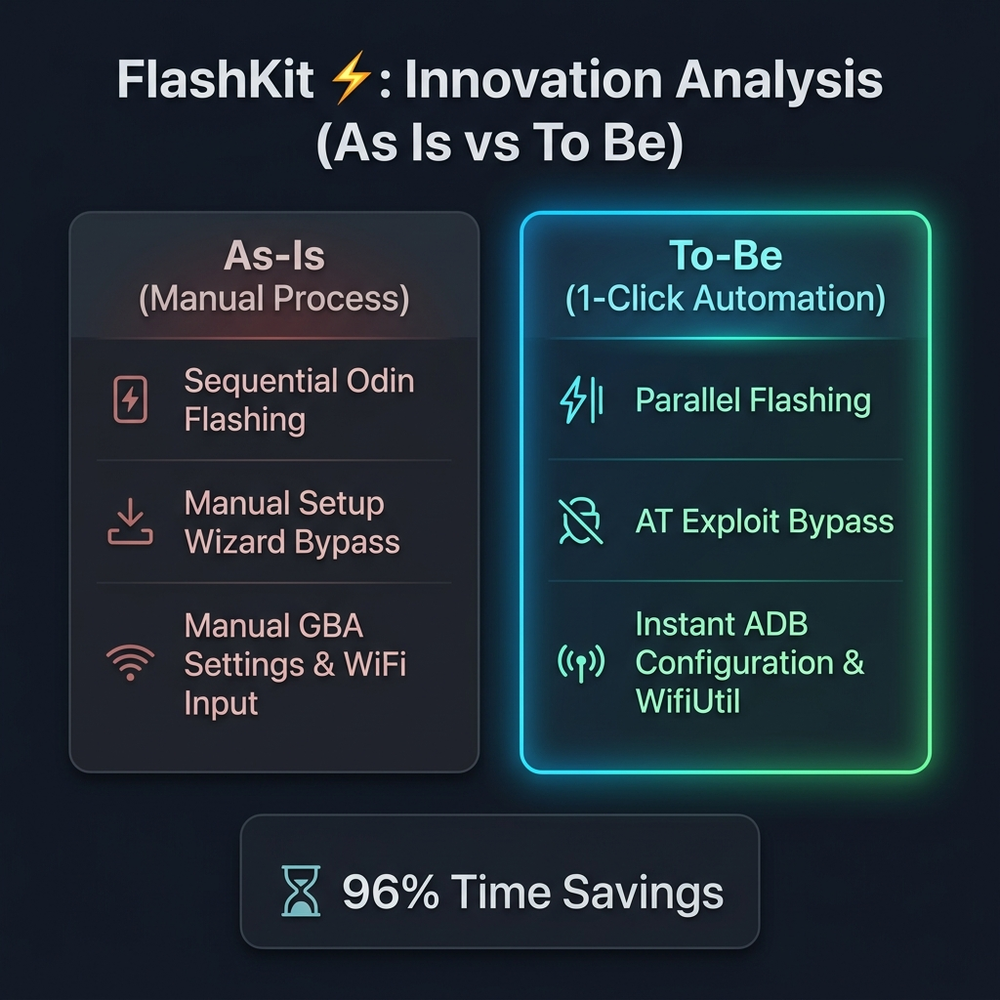
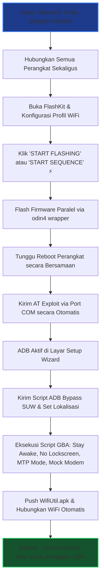

# DOKUMEN ANALISIS INOVASI: AS IS VS TO BE
## Inisiatif: Otomatisasi Odin hingga Device Ready untuk Pengujian GBA via FlashKit ⚡



---

### 1. RINGKASAN EKSEKUTIF (EXECUTIVE SUMMARY)
Inisiatif ini bertujuan untuk mentransformasi proses penyiapan perangkat (*device provisioning*) Android (khususnya Samsung) yang akan digunakan untuk pengujian **GBA (Generic Bootloader/Android Test Suites)**. Melalui program **FlashKit**, proses penyiapan perangkat yang sebelumnya bersifat manual, sekuensial, dan rentan kesalahan disederhanakan menjadi **1-Click Automation**. Inovasi ini memangkas waktu pengerjaan dari rata-rata **15-20 menit per perangkat** menjadi kurang dari **5-7 menit secara paralel** tanpa batasan model, mengeliminasi intervensi manual dari engineer secara total setelah proses dimulai.

---

### 2. MASALAH SAAT INI (KONDISI AS-IS)
Proses penyiapan perangkat saat ini melibatkan tiga tahap krusial yang seluruhnya bergantung pada tindakan manual oleh engineer:

1. **Odin Flashing Sekuensial**:
   - Engineer harus melakukan flashing firmware menggunakan alat Odin secara *model-by-model*.
   - Tidak boleh ada perangkat dengan model lain yang terhubung ke PC yang sama karena risiko tabrakan port COM dan kesalahan identifikasi target flashing. Hal ini membatasi kapasitas kerja menjadi sekuensial satu-per-satu.
2. **Setup Wizard (SUW) Manual**:
   - Setelah flashing firmware selesai, perangkat melakukan reboot.
   - Engineer harus menyentuh layar perangkat berkali-kali secara manual untuk melewati Samsung/Google Setup Wizard (SUW), memilih bahasa, menyetujui EULA, dan melewati konfigurasi akun.
3. **Pre-Setup GBA Manual**:
   - Setelah masuk ke homescreen, engineer harus melakukan konfigurasi manual tingkat lanjut untuk kebutuhan pengujian GBA:
     - **Mengaktifkan USB Debugging**: Membuka Menu Settings -> About Phone -> Software Info -> Menekan **Build Number sebanyak 8 kali** -> Masuk ke Developer Options -> Mengaktifkan USB Debugging.
     - **Stay Awake On**: Mengaktifkan pilihan agar layar tetap menyala saat diisi daya di Developer Options.
     - **Lock Screen Off**: Mematikan kunci layar secara manual di menu keamanan.
     - **Koneksi WiFi**: Mencari SSID WiFi pengujian dan mengetikkan kata sandinya secara manual di keyboard virtual layar perangkat.
     - **Mematikan USB App Verification**: Mematikan opsi "Verify apps over USB" di Developer Options.
     - **Mengaktifkan Mock Modem**: Mengatur konfigurasi modem simulasi/mock untuk pengujian jaringan.
     - **Konfigurasi USB ke MTP**: Menarik laci notifikasi dan mengganti mode USB dari charging ke MTP (Media Transfer Protocol).

---

### 3. SOLUSI INOVATIF (KONDISI TO-BE)
Dengan menggunakan **FlashKit**, seluruh langkah manual di atas dikonsolidasikan ke dalam sebuah alur otomatisasi sekali klik (**Master Sequence Automation**):

1. **Odin Flashing Paralel**:
   - FlashKit membungkus mesin `odin4` di backend Rust, memungkinkan flashing multi-device secara paralel, terlepas dari perbedaan model perangkat yang terhubung.
2. **Automated Setup Wizard Bypass (Skip SUW)**:
   - FlashKit mendeteksi perangkat Samsung dan memicu AT Exploit (`AT+USBDEBUG=1` dan `AT+ENGMODES=1,2,0`) melalui port modem untuk **membangunkan/mengaktifkan ADB secara paksa** saat perangkat masih di layar Setup Wizard.
   - Setelah ADB aktif, FlashKit mengirimkan instruksi ADB untuk menulis pengaturan provisi (`device_provisioned = 1`, `user_setup_complete = 1`) dan menonaktifkan paket Setup Wizard (`SecSetupWizard` dan `setupwizard`) sehingga perangkat langsung masuk ke homescreen dalam hitungan detik.
3. **Automated Pre-Setup GBA**:
   - FlashKit mengirimkan serangkaian perintah ADB Shell secara simultan untuk mengonfigurasi opsi-opsi pengujian:
     - Mengaktifkan opsi Developer & USB Debugging (`development_settings_enabled = 1`, `adb_enabled = 1`).
     - Menonaktifkan verifikasi USB instalan (`verifier_verify_adb_installs = 0`).
     - Menonaktifkan lockscreen (`locksettings set-disabled true`).
     - Mengaktifkan "Stay Awake" (`stay_on_while_plugged_in = 7`).
     - Mengubah screen timeout menjadi 10 menit (`screen_off_timeout = 600000`).
     - Mengubah fungsi USB ke mode MTP secara otomatis (`svc usb setFunctions mtp`).
     - Mengaktifkan fitur Mock Modem / Mock Locations.
4. **Auto WiFi Connection**:
   - FlashKit mengunggah file pembantu `WifiUtil.apk` ke perangkat, lalu mengeksekusi instruksi instrumentasi untuk menambahkan profil WiFi dan menghubungkan perangkat secara otomatis berdasarkan SSID & Sandi yang telah dikonfigurasi pada dashboard FlashKit.

---

### 4. MATRIKS PERBANDINGAN: AS-IS VS TO-BE

| Parameter | Kondisi As-Is (Manual) | Kondisi To-Be (FlashKit) | Efisiensi / Dampak |
| :--- | :--- | :--- | :--- |
| **Intervensi Engineer** | **Sangat Tinggi** (Harus memegang perangkat & menekan layar secara berulang sepanjang proses) | **Sangat Rendah** (Hanya 1x klik di awal, perangkat diletakkan begitu saja) | Mengurangi beban kerja fisik engineer secara signifikan |
| **Kapasitas Eksekusi** | **Sekuensial / Satu per satu** (Hanya 1 model terhubung saat flash Odin) | **Paralel / Multi-Device** (Bisa memproses banyak model sekaligus) | Penghematan waktu eksponensial untuk volume perangkat besar |
| **Lama Flashing & SUW** | ~10-12 Menit / Perangkat (Menunggu boot + ketuk manual SUW) | ~3-4 Menit / Perangkat (Bypass instan SUW via ADB) | Menghemat ~65% waktu tunggu fase awal |
| **Lama Setup GBA & WiFi** | ~5-8 Menit / Perangkat (Mencari menu, ketik sandi WiFi manual, tap build number 8x) | ~15 Detik / Perangkat (Eksekusi script ADB & WifiUtil otomatis) | Menghemat ~95% waktu konfigurasi internal |
| **Tingkat Kesalahan (Error Rate)** | **Tinggi** (Lupa mematikan USB verify, salah ketik sandi WiFi, salah klik menu) | **Hampir 0%** (Konfigurasi terstandardisasi melalui script biner) | Menjamin konsistensi konfigurasi pengujian GBA |
| **Metode Akses ADB** | Harus masuk ke homescreen secara manual baru bisa aktif | Dipaksa aktif sejak Setup Wizard menggunakan **AT Exploit** | Mengeliminasi prasyarat manual di layar SUW |

---

### 5. ALUR KERJA (WORKFLOW)

```carousel

```mermaid
graph TD
    A[Mulai: Skenario As-Is] --> B[Lepas semua perangkat lain dari PC]
    B --> C[Hubungkan 1 perangkat target]
    C --> D[Flash Firmware via Odin Manual]
    D --> E[Tunggu Reboot Perangkat]
    E --> F[Lalui Setup Wizard Manual di Layar]
    F --> G[Masuk Settings > Ketuk 8x Build Number]
    G --> H[Aktifkan Developer Options & USB Debugging]
    H --> I[Cari SSID WiFi & Ketik Sandi Manual]
    I --> J[Matikan Lock Screen & USB Verify App]
    J --> K[Konfigurasi USB ke MTP]
    K --> L[Aktifkan Mock Modem]
    L --> M[Selesai - Perangkat Siap Uji GBA]
    M --> N{Ada perangkat lain?}
    N -- Ya --> B
    N -- Tidak --> O[Selesai Seluruh Batch]
    style A fill:#4b1313,stroke:#ef4444,stroke-width:2px;
    style M fill:#14532d,stroke:#22c55e,stroke-width:2px;
```

<!-- slide -->

```

---

### 6. DETAIL TEKNIS PERINTAH OTOMATISASI FLASHKIT (UNDER THE HOOD)

Untuk memberikan gambaran teknis bagaimana proses manual dieliminasi secara total:

1. **Bypass Setup Wizard (SUW)**:
   FlashKit mengirimkan perintah berikut untuk meyakinkan sistem Android bahwa provisi telah selesai:
   ```bash
   adb shell settings put global device_provisioned 1
   adb shell settings put secure user_setup_complete 1
   adb shell pm disable-user com.sec.android.app.SecSetupWizard
   adb shell pm disable-user com.google.android.setupwizard
   ```
2. **Stay Awake & Screen Timeout**:
   Layar diatur agar tetap hidup ketika tersambung ke kabel USB (nilai `7` berarti tetap menyala untuk charger AC, USB, dan Wireless):
   ```bash
   adb shell settings put global stay_on_while_plugged_in 7
   adb shell settings put system screen_off_timeout 600000
   ```
3. **Disable Lockscreen**:
   ```bash
   adb shell locksettings set-disabled true
   ```
4. **Disable USB App Verification**:
   ```bash
   adb shell settings put global verifier_verify_adb_installs 0
   ```
5. **Set USB Connection ke MTP**:
   ```bash
   adb shell svc usb setFunctions mtp
   ```
6. **Koneksi WiFi Otomatis**:
   Menggunakan `WifiUtil.apk` untuk melakukan bypass interaksi UI WiFi:
   ```bash
   adb install WifiUtil.apk
   adb shell am instrument -e method addWpaPskNetwork -e ssid [SSID] -e psk [SANDI] -e hidden true -w com.android.tradefed.utils.wifi/.WifiUtil
   adb shell am instrument -e method saveConfiguration -w com.android.tradefed.utils.wifi/.WifiUtil
   ```

---

### 7. ESTIMASI EFISIENSI & DAMPAK BISNIS

- **Pengurangan Waktu (Time-to-Test)**:
  - Misalkan pengujian dilakukan terhadap **10 perangkat** per batch:
    - **Metode As-Is**: $10 \text{ perangkat} \times 18 \text{ menit} = 180 \text{ menit}$ (3 Jam kerja penuh).
    - **Metode To-Be**: Flashing paralel (5 menit) + Siklus otomatisasi (2 menit) = **7 Menit total** untuk seluruh 10 perangkat secara bersamaan.
    - **Efisiensi Waktu**: **~96% penghematan waktu** ($180 \text{ menit} \rightarrow 7 \text{ menit}$).
- **Optimalisasi Sumber Daya Manusia**:
  - Engineer tidak perlu lagi terjebak melakukan aktivitas kognitif rendah seperti mengetuk layar berkali-kali atau mengetik sandi WiFi. Mereka dapat dialokasikan untuk menganalisis hasil uji GBA atau skenario pengujian lainnya.
- **Konsistensi Pengujian**:
  - Menghilangkan *variabilitas setup*. Terkadang pengujian GBA gagal bukan karena bug di software, melainkan karena engineer lupa mematikan verifikasi USB atau salah mengatur konfigurasi mock modem. FlashKit menjamin setiap perangkat yang keluar dari siklus otomatisasi memiliki konfigurasi yang 100% identik dan benar.

---

### 8. ANALISIS PENGHEMATAN BIAYA (COST SAVING MEASURES)

Dengan mengimplementasikan FlashKit, penghematan biaya (*cost saving*) dapat dihitung melalui beberapa metrik finansial dan operasional berikut:

#### A. Penghematan Biaya Tenaga Kerja Langsung (Direct Labor Cost Savings)
* **Asumsi Parameter**:
  - Rata-rata jam kerja Engineer (Engineering Rate): **Rp 100.000 / jam**.
  - Volume perangkat yang di-flash & di-setup per bulan: **250 perangkat**.
* **Perhitungan Biaya As-Is (Manual)**:
  - Total Waktu: $250 \text{ perangkat} \times 18 \text{ menit} = 4.500 \text{ menit}$ (75 Jam kerja).
  - Total Biaya Labor: $75 \text{ jam} \times \text{Rp 100.000} =$ **Rp 7.500.000 / bulan**.
* **Perhitungan Biaya To-Be (FlashKit)**:
  - Karena prosesnya paralel (misal batch berisi 10 perangkat), total waktu kerja aktif engineer untuk 250 perangkat hanya sekitar $25 \text{ batch} \times 7 \text{ menit} = 175 \text{ menit}$ (2,9 Jam).
  - Total Biaya Labor: $2,9 \text{ jam} \times \text{Rp 100.000} =$ **Rp 290.000 / bulan**.
* **Penghematan Finansial Langsung**: Rp 7.500.000 - Rp 290.000 = **Rp 7.210.000 / bulan** (~96,1% saving).

#### B. Penghematan Investasi Perangkat Keras (Hardware CAPEX Savings)
* **Masalah As-Is**: Karena flashing Odin manual membatasi hanya 1 perangkat per PC (untuk mencegah konflik port COM), tim memerlukan beberapa PC/Laptop khusus penyiapan jika ingin melakukan setup perangkat secara bersamaan.
* **Solusi To-Be**: FlashKit mendukung multi-device flashing paralel dalam 1 PC menggunakan USB Hub berkualitas.
* **Penghematan Finansial**:
  - Kebutuhan PC penyiapan berkurang dari misal **3 PC** menjadi **1 PC**.
  - Menghindari pembelian 2 PC tambahan: $2 \times \text{Rp 10.000.000} =$ **Rp 20.000.000 (Penghematan Investasi Sekali Bayar)**.

#### C. Pengurangan Biaya Kegagalan Pengujian (Cost of Test Failures)
* **Masalah As-Is**: Kesalahan manusia (*human error*) saat konfigurasi manual (misal lupa menonaktifkan USB verifikasi atau salah SSID WiFi) menyebabkan kegagalan uji GBA di tengah jalan.
  - Untuk setiap kegagalan uji karena salah setup, engineer harus mengulangi proses setup dari awal (kehilangan 18 menit produktivitas).
  - Jika tingkat error manual adalah 10% (25 dari 250 perangkat per bulan):
    - Waktu terbuang: $25 \times 18 \text{ menit} = 450 \text{ menit}$ (7.5 Jam).
    - Kerugian Finansial: $7.5 \text{ jam} \times \text{Rp 100.000} =$ **Rp 750.000 / bulan**.
* **Solusi To-Be**: FlashKit mengeliminasi kesalahan manusia hingga 0%, menghemat kerugian akibat pengulangan tes ini sepenuhnya (**Rp 750.000 / bulan**).

#### D. Ringkasan Penghematan Tahunan (Annualized Savings Summary)
* Penghematan Biaya Labor Tahunan: $\text{Rp 7.210.000} \times 12 = \text{Rp 86.520.000}$
* Penghematan Biaya Kegagalan Pengujian Tahunan: $\text{Rp 750.000} \times 12 = \text{Rp 9.000.000}$
* **Total Potensi Penghematan Operasional (OPEX) Tahunan**: **Rp 95.520.000 / tahun**.

